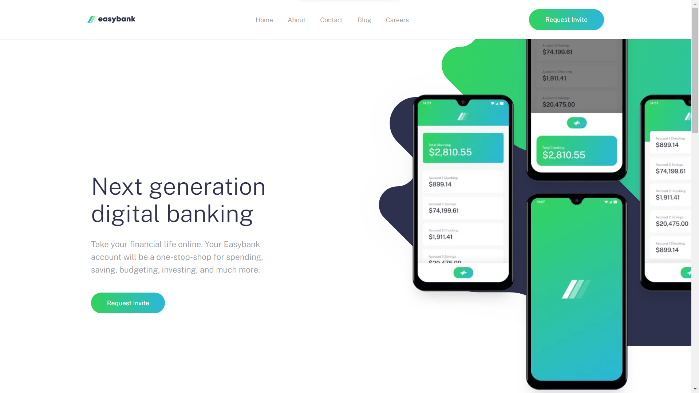
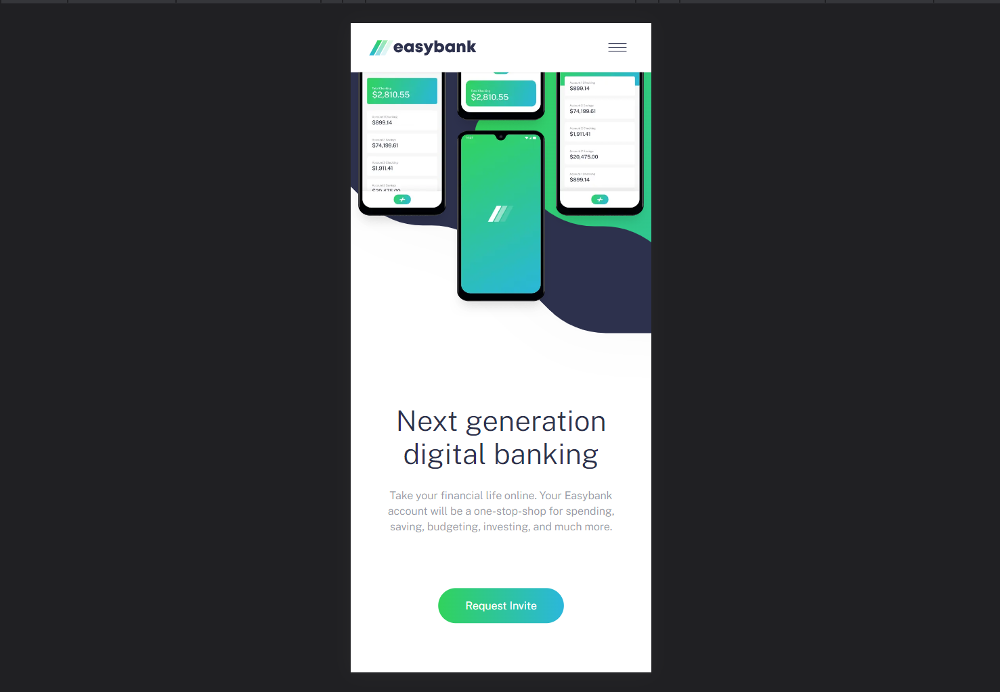
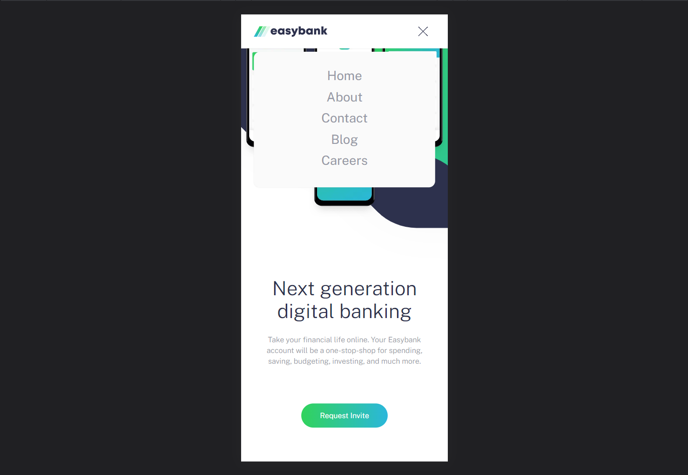

# Frontend Mentor - Easybank Landing Page Solution

This is my solution to the [Easybank landing page challenge on Frontend Mentor](https://www.frontendmentor.io/challenges/easybank-landing-page-WaUhkoDN). Frontend Mentor challenges are a great way to improve your coding skills by building realistic projects.

## Table of Contents

- [Overview](#overview)
  - [The Challenge](#the-challenge)
  - [Screenshot](#screenshot)
  - [Links](#links)
- [My Process](#my-process)
  - [Built With](#built-with)
  - [What I Learned](#what-i-learned)
  - [Continued Development](#continued-development)
  - [Useful Resources](#useful-resources)
- [Author](#author)
- [Acknowledgments](#acknowledgments)

## Overview

### The Challenge

The challenge was to create a responsive landing page for Easybank, ensuring that users can view the optimal layout on various device screen sizes and that interactive elements have hover states.

### Screenshot

You can view a screenshot of my solution above.

### Links

- [Solution URL](https://github.com/vashu-kashyap/Frontend-Mentor-Easybank-Landing-Page-Solution)
- [Live Site URL](https://easy-bank-next-js-tailwind-css.netlify.app/)

## My Process

### Built With

- Semantic HTML5 markup
- CSS custom properties
- Flexbox and CSS Grid
- Mobile-first workflow
- [React](https://reactjs.org/) - JavaScript library
- [Next.js](https://nextjs.org/) - React framework
- [Styled Components](https://styled-components.com/) - For styles
- [Tailwind CSS](https://tailwindcss.com/) - Utility-first CSS framework

### What I Learned

During this project, I learned:

- The importance of mobile-first design and responsive web development.
- How to use Next.js to optimize image loading for a faster website.
- Implementing hover effects on SVG images for a more interactive user experience.
- Font optimization techniques in Next.js for improved web performance.

### Continued Development

In future projects, I plan to continue focusing on:

- Enhancing my design skills to create visually appealing websites.
- Exploring more advanced CSS techniques and animations.
- Further optimizing website performance.

### Useful Resources

Here are some resources that helped me during this project:

- [Frontend Mentor](https://www.frontendmentor.io) - An excellent platform for practicing and improving frontend development skills.
- [Next.js Image Optimization](https://nextjs.org/docs/basic-features/image-optimization) - Next.js documentation on optimizing images.
- [Next.js Font Optimization](https://nextjs.org/docs/advanced-features/font-optimization) - Next.js documentation on font optimization.

## Author

- Linktr.ee [Im.vashukashyap](https://linktr.ee/Im.vashukashyap)
- Linkedin - [@Im.vashukashyap](https://www.linkedin.com/in/im-vashukashyap/)
- Instagram - [@Im.vashukashyap](https://www.instagram.com/im.vashukashyap/)

## Acknowledgments

I'd like to acknowledge the Frontend Mentor community for their valuable feedback and support during this project.
